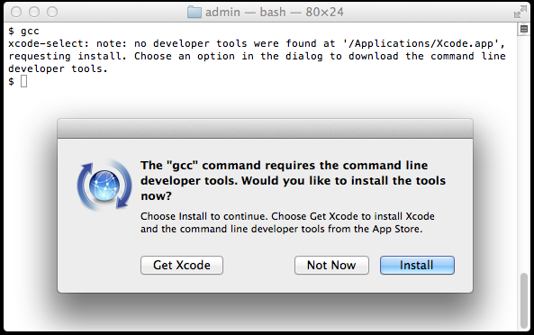

# 安装 Ruby on Rails · Mac OS X EI Caption

最近在学习 Ruby 和 Rails，OS X 系统自带的 Ruby 是在 `/System` 文件夹下面，升级和维护既不方便也不安全，所以想要自己重新安装一下。在官方和网络上查看了一些安装教程，大概有四类方法：

1. 通过源码安装
2. 使用安装器 Installer ，比如：[ruby-install](https://github.com/postmodern/ruby-install#readme)
3. 通过系统的包管理器，比如：apt-get（Debian）、yum（CentOS）、homebrew（Mac）
4. 使用 Ruby 管理工具，比如：[rbenv](https://github.com/rbenv/rbenv#readme)、[RVM](https://rvm.io)

权衡比较之后，我决定使用 RVM 来安装和管理 Ruby。这也是大多数人推荐的方法。在我使用了一段时间后，发现 RVM 确实一个非常棒的工具。

我的安装过程主要参考了一篇国外的文章，<http://railsapps.github.io/installrubyonrails-mac.html>，文章讲述的非常详尽而且作者还在保持更新。我大体是按照他的结构写下的该教程，中间夹杂了一些自己学习到的东西。

## 一、Xcode Command Line Tools

安装 Ruby 和 Rails 之前需要安装 Xcode Command Line Tools。Command Line Tools 提供了Ruby 和 Rails 工程需要的 C 语言编译器。 Xcode 是 OS X 开发软件包。如果你为 Apple 操作系统做开发的话，需要安装 Xcode 的完整版本。如果只是为 Rails 做开发，你只需要安装 Xcode Command Line Tools。

### 完整安装

去 App Store 安装 Xcode。

### 仅安装 Command Line Tools

当你在终端输入 gcc、git 或 make 等需要 Command Line Tools 的命令时，操作系统会提示你安装。例如，输入：

```
$ gcc
```

如果 Xcode Command Line Tools 没有被安装，你会看到一个提醒框：



点击「Get Xcode」会进入 App Store 安装完整的 Xcode。我们仅仅需要 Xcode Command Line Tools，所以点击「Install」开始安装。

键入命令检测是否安装成功：

```
$ xcode-select -p
```

如果你看到：

```
/Applications/Xcode.app/Contents/Developer
```

或

```
/Library/Developer/CommandLineTools
```

那么就说明安装成功了。

## 二、Homebrew

[Homebrew](http://brew.sh/index_zh-cn.html) 是 OS X 上的一个包管理工具，许多开发者都用 Homebrew 来安装和管理 Unix 软件包。Homebrew 会将所有包安装到 `/usr/local/Cellar` 文件夹，并在 `/usr/local/bin` 下生成软链接，所以不同担心软件包满天飞。

Homebrew 在安装依赖时会尝试使用系统中已经存在的包，所以不会产生冗余。我现在就使用 Homebrew 来管理我的软件包，你可以登录他们的[官网](http://brew.sh/index_zh-cn.html) 了解更多信息。

我们将要通过 RVM（Ruby Version Manager）来安装 Ruby，而 RVM 需要 Homebrew，所以我们在安装 RVM 之前安装好 Homebrew。

### 安装 Homebrew

在命令行下输入：

```
/usr/bin/ruby -e "$(curl -fsSL https://raw.githubusercontent.com/Homebrew/install/master/install)"
```

### 关于系统自带的 Ruby

我们使用 Ruby 去安装的 Homebrew，这里的 Ruby 是 Mac OS X 预安装的版本，位于 `/System/Library/Frameworks/Ruby.framework/Versions/2.0/` 下，不利于升级和维护，我们之后会通过 RVM 安装一个新的版本。

### `/usr/local` 权限问题

Homebrew 安装脚本运行过程中会告知你脚本执行的内容，并要求你输入管理员密码。脚本会把你的 `/usr/local` 目录的所有权改为你当前用户（如果你尝试以 root 权限运行脚本，脚本会中断）。起初我比较抵触这样的做法，后来觉得这种方式是更合理的。`/usr/local` 用于存放用户的库和执行文件，如果每次往这个文件夹中安装程序都需要赋予 root 权限，既不安全也不非常的麻烦。

### 常用操作

检测版本：

```
$ brew --version
```

安装软件包：

```
$ brew install wget git
```

查看已经安装的软件包：

```
$ brew list
```

升级软件包：

```
$ brew update
```

## 三、RVM

[RVM](https://rvm.io) 能在系统中安装和管理多个版本的 Ruby，还能够管理多个 gem 集。如果你打算学习 Ruby / Rails ， RVM 是一个必不可少的工具。

新版的 RVM 具有 [autolibs](https://rvm.io/rvm/autolibs) 功能，它可以利用系统安装的包管理器（如：macports、homebrew等）自动安装依赖包。autolibs 属性的值默认是 enable ，这表示 RVM 会自动检测你系统的包管理器，在 Mac 下检测的顺序是 macports、homebrew、smf、fink。如果一个都没有安装的话，RVM 会安装 macports。我们在上一步已经安装过了 homebrew，所以可以不用理会。

还有一点需要注意，网络上的教程提示 Mac 的用户名不能包含空格，如果有的话需要[修改用户名](https://support.apple.com/zh-cn/HT201548)。

### 不同安装方法的区别

1. **单用户安装** - RVM 的全部文件会安装在 `$HOME/.rvm` 目录下。与其它用户分离。
2. **多用户安装** - 安装脚本会自动判断当前用户的权限，如果是有 root 权限的，RVM 会安装到 `/usr/local/rvm` 下，所有的用户都可以使用，如果你安装了单用户版本，会覆盖多用户版本。另外，**这种安装方式会带来安全风险**。
3. **混合方式** - 安装方式与多用户安装一致，RVM 的程序也会安装到 `/usr/local/rvm` 下，只是通过配置用户环境变量，让 RVM 把 rubies/gemsets 安装在用户目录下。

比较推荐的方式是使用单用户安装的形式，所以安装命令最好不要用 `sodu`。想了解更多的区别，可以查看 [官网安装说明](https://rvm.io/rvm/install#installation-explained)。

### 安装 GPG

GPG 是一个加密软件，安装 RVM 时会需要。

使用 Homebrew 来安装 GPG：

```
$ brew install gpg
```

向 GPG 内导入 RVM 的密钥：

```
$ gpg --keyserver hkp://keys.gnupg.net --recv-keys 409B6B1796C275462A1703113804BB82D39DC0E3
```

或

```
$ command curl -sSL https://rvm.io/mpapis.asc | gpg --import -
```

### 安装 RVM

导入成功后，安装 RVM，官方网站提供了多种[安装方式](https://rvm.io/rvm/install)，可以带上参数直接安装 ruby 等。如果你是第一次安装和使用 RVM，推荐先安装最基本的程序：

```
$ \curl -sSL https://get.rvm.io | bash -s stable
```

我在安装时出现了下面这样的错误提示：

```
curl: (35) Server aborted the SSL handshake
```

在我重试了几次后又可以下载了。

下载并安装完成后，脚本会把 RVM 的 PATH 路径和 source 命令追加到 shell 配置文件中，会有如下提示：

```
Upgrading the RVM installation in /Users/wangyu/.rvm/
    Adding rvm PATH line to /Users/wangyu/.profile /Users/wangyu/.mkshrc /Users/wangyu/.bashrc /Users/wangyu/.zshrc.
    Adding rvm loading line to /Users/wangyu/.profile /Users/wangyu/.bash_profile /Users/wangyu/.zlogin.
Upgrade of RVM in /Users/wangyu/.rvm/ is complete.
```

想了解关于几个文件的详细区别以及修复配置文件的方法，可以查看 [官方 FAQ](https://rvm.io/support/faq#what-shell-login-means-bash-l)。

重新进入终端（或执行 `$ source ~/.rvm/scripts/rvm`），检测是否安装成功：

```
$ rvm info
```

该命令会详细当前系统信息、ruby 和 gem 版本、环境变量等信息（非常赞！）。

### 升级和卸载

升级 RVM：

```
$ rvm get stable
```

卸载 RVM：

```
$ rvm implode
```

但是该命令会删除所有安装的内容，包括主程序、Ruby、Gemsets，还原环境变量设置，但不会还原对 shell 配置文件的修改。

如果遇到其它问题，你还可以通过 [IRC #rvm](http://webchat.freenode.net/?channels=rvm) 与 RVM 的团队直接联系。

## 四、Ruby

安装完 RVM 之后，就可以开始安装 [Ruby](https://www.ruby-lang.org/en/) 了。RVM 会把 Ruby 下载安装到 RVM 目录内，然后通过修改和配置环境变量，取代系统的 Ruby、Gem 执行程序。RVM 只能控制通过 RVM 自身安装的 Ruby 和 Gem，不会影响系统自带的 Ruby。

### 安装方法

你可以在官网上查看[推荐的 Ruby 版本](https://www.ruby-lang.org/en/downloads/)，也可以让 RVM 列出已知的版本： $ rvm list known

这里安装一下最新的 2.3.0 版本： $ rvm install ruby-2.3.0

检测是否安装成功： $ which ruby /Users/wangyu/.rvm/rubies/ruby-2.3.0/bin/ruby $ ruby -v ruby 2.3.0p0 (2015-12-25 revision 53290) [x86_64-darwin15]

### 多版本的安装和管理

可以用 `rvm install` 命令继续安装其它版本的 Ruby，另外安装一个最新版本的 Ruby： $ rvm install ruby-head

查看已经安装的 Ruby 列表： $ rvm list

切换 Ruby： $ rvm use 2.3.0

卸载 Ruby： $ rvm remove ruby-head

## 五、RubyGems

[RubyGems](https://rubygems.org) 是 Ruby 的包管理工具。上面安装 Ruby 时，RubyGems 也会自动安装。我们先查看一下安装的 RubyGems 版本： $ gem -v 2.4.5.1

可以看到附带安装的 RubyGems 版本是 2.4.5.1，但 [新版本的 RubyGems 已经发布](https://rubygems.org/gems/rubygems-update)，我们可以通过 `gem update --system` 将 RubyGems 升级到最新版本： $ gem update --system

升级后重新查看一下： $ gem -v 2.6.3

## 六、RVM Gemsets

RVM 提供的多版本 Ruby 是互相独立的、互相分隔的。换句话说，每个版本的 Ruby 都有自己的 gemsets，不同版本间是不交叉的。gemset 又是什么概念呢？ gemset 可以理解为是一个独立的虚拟 gem 环境，你可以为一个 Ruby 建立多个 gemset，它们之间是相互独立的，比如你有两个项目：一个是 Rails 4.2，一个是 Rails 3.2，你就可以建立两个 gemset，分别安装 Rails 4.2 版本和 3.2 版本，通过 RVM 来切换，他们之间不会产生冲突。

如果你想充分了解后再操作 gemset，可以先阅读一下[官方文档](https://rvm.io/gemsets/creating)。

并不是所有的开发者都使用 gemset 来管理 gems，不过很多人都建议使用。这篇教程按照 [RVM](https://rvm.io/rvm/best-practices#no-3-use-per-project-gemsets) 和 [参考文章](http://railsapps.github.io/installrubyonrails-mac.html) 推荐的方式，为每一个工程建立独有的 gemset。

查看当前的 gemset： $ rvm gemset list

```
gemsets for ruby-2.3.0 (found in /Users/wangyu/.rvm/gems/ruby-2.3.0)
=> (default)
   global
```

RVM 在安装 Ruby 后，会自动安装 default 和 global 两个 gameset。

### Global Gemset

RVM 会为每个 Ruby 编译器预建一个 global gemset。在这里安装的 gems 会与该 Ruby 下创建的其它 gemsets 共享。

所以我们可以把一个 Ruby 下项目通用的 gems 安装到 global gemset 中。

切换 gemset 到 global gemset： $ rvm use @global Using /Users/wangyu/.rvm/gems/ruby-2.3.0 with gemset global 你可以试试切换回 @default，切换前后通过 `rvm info` 查看一下 RVM 对变量的修改，能够对 gemset 工作原理有更好的了解。

### 查看和升级 gems

可以查看一下已经安装的 gems：

```
$ gem list
```

可以看到里面已经预装的 gems，但有一些可能已经不是最新版的了。

升级 gems：

```
$ gem update
```

### 跳过 gem 文档安装

默认在你安装 gems 的同时会安装文档。开发过程中基本不会用到这些文档。所以可以通过修改 .gemrc 配置文件，跳过文档的安装，加快安装速度。

修改 .gemrc：

```
$ echo "gem: --no-document" >> ~/.gemrc
```

### 安装 Bundler

[Bundler](https://rubygems.org/gems/bundler) 是开发和运行 Rails 必不可少的工具，老版本的 RVM 是自动安装的，新版本的已经不会自动安装了。 我们可以安装到 @global gemset 中。

```
$ gem install bundler
```

### 安装 Nokogiri

[Nokogiri](http://www.nokogiri.org) 是很多 gem 的依赖包。每次安装 Nokogiri 都要经历比较长的编译过程（大概两三分钟）。为了节省时间，我们把它安装到 @global gemset 中。

```
$ gem install nokogiri
```

安装过程需要一段时间，看上去像是卡主了，除非你看到了明确的错误提示或者等了十几分钟了，否则不要中断安装。

如果你的系统不满足 Nokogiri 的安装条件，安装有可能会失败。你可以上 [Stack Overflow](http://stackoverflow.com/questions/tagged/nokogiri) 寻找帮助。

## 七、Rails

[Rails](http://rubyonrails.org) 更新很快，而且不兼容历史版本，安装前先查看一下 [最新版本](http://rubygems.org/gems/rails)，在写这篇教程时，最新的稳定版本是 4.2.6。

你可以直接把 Rails 安装到 global gemset，但像前面建议的那样，最好把 Rails 安装到项目指定的 gemset 中，保持 global gemset 最小化，这样各个工程就可以独立安装合适版本的 Rails。

之前我们把 gemset 切换到了 global，如果直接运行 `gem install rails` 会安装到 global gemset 中。所以，我们用下面的命令创建新的 gemset 并切换过去：

```
$ rvm use ruby-2.3.0@rails4.2 --create
```

安装 Rails，用下面的命令可以安装最新的稳定版本：

```
$ gem install rails
```

如果你想安装最新的 beta 版本，你可以添加 `--pre` 参数：

```
$ gem install rails --pre
```

或者指定版本：

```
$ gem install rails --version=3.2.18
```

验证一下安装的 Rails 版本：

```
$ rails -v
Rails 4.2.5
```

## 结尾

到这里为止，Rails 的开发环境就搭建完成了。

在下一篇教程里会尝试建立一个新 Rails 项目。
